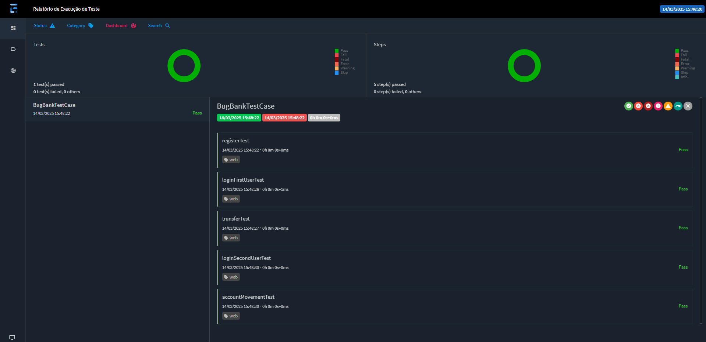

## Desafio Tecnico DBServer

### [Bug Bank](https://bugbank.netlify.app/)

>*O banco com bugs e falhas do seu jeito.*
>
>*É um Bug Bank, para que? É pratique de testes e automação de testes.*

---

#### O projeto é exclusivamente para [DBServer](https://db.tec.br/).

---

:clipboard: Realizar Transferência entre Contas Passo –a –passo :

:heavy_check_mark: Acessar o site [Bug Bank](https://bugbank.netlify.app/)

:heavy_check_mark: Criar duas contas com Saldo e salvar os seus dados.

:heavy_check_mark: Acessar uma conta e realizar uma transferência de valor para outra.

:heavy_check_mark: Validar a saída e entrada de valores das contas envolvidas

---

### Ferramentas que foi ulitizado?

#### Construido com a estrutura:

:pushpin: [MAVEN](https://maven.apache.org/download.cgi),

:pushpin: [JAVA 17](https://www.oracle.com/java/technologies/javase/jdk17-archive-downloads.html)

#### Dependencias:
:pushpin: [TestNG](https://mvnrepository.com/artifact/org.testng/testng/7.10.2),  

:pushpin: [Selenium Java](https://mvnrepository.com/artifact/org.seleniumhq.selenium/selenium-java/4.21.0),  

:pushpin: [WebDriverManager](https://mvnrepository.com/artifact/io.github.bonigarcia/webdrivermanager/5.8.0),

:pushpin: [Extent Reports TestNG Adapter](https://mvnrepository.com/artifact/com.aventstack/extentreports-testng-adapter/1.0.3)

:pushpin: [Java Faker](https://mvnrepository.com/artifact/com.github.javafaker/javafaker/1.0.2)

---

### Baixando o projeto:

Para baixar o projeto, abrir o comando ou dentro IDE:
```bash
git clone https://github.com/loopfagundes/db_desafio_web.git
```

#### Como executar?
Para executar na sua máquina local, o comando ou através de sua IDE:
```bash
mvn test
```
Padrão do browser Chrome.
Para executar no Firefox ou Edge,  caminho para acessar de pastas dentro IDE:
```java
src/main/java/app.netlify.bugbank/utils/BaseTest
```
```
@BeforeMethod  
DriverFactory.createInstance(BrowserEnum.CHROME);
```
`BrowserEnum.Chrome` ".Chrome" tem opção para Firefox ou Edge.

---
#### Report:
Após a execução do projeto, para visualizar o relatório: 
Abra a pasta de report e selecione o arquivo report.html. 
Clique com o botão direito do mouse, vá em "Open in", depois "Browser" e escolha o navegador da sua preferência.



---
Feito com bug, café e muito esforço :beetle::coffee:

